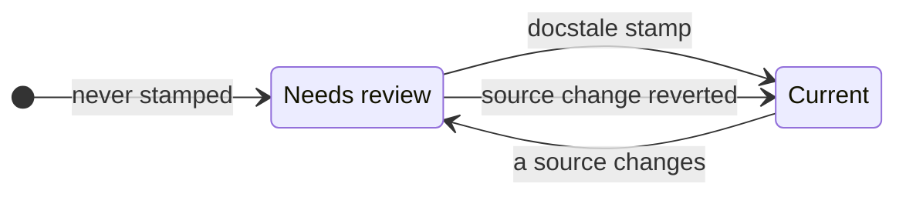

# Docstale reference

This page describes every setting and behavior. To set docstale up, start with
the [README](../README.md).

## Configure documents

Each key in `[documents]` names a document, and its value lists the source
patterns that may affect it.

### Source patterns

Source patterns are relative to the repository root and are case sensitive.

- `pyproject.toml` matches one root file.
- `src/` matches every file under the root `src` directory.
- `src/*.py` matches Python files directly inside `src`.
- `**/*.py` matches Python files at any depth.

Every pattern is anchored to the repository root. For example, `src/` does not
match `vendor/src/`. Use an explicit `**/` prefix when a pattern should match at
any depth.

A directory pattern without glob characters, such as `vendor/lib/`, also
matches a submodule or symlink at that path. A submodule counts as changed when
its commit changes, not when files inside it are edited.

### Shared source lists

A `[sets]` table names a source list once so that several documents can include
it. A source written as `@name` inserts the set with that name.

```toml
[sets]
build = ["pixi.toml", "pyproject.toml"]

[documents]
"README.md" = ["@build", "src/"]
"docs/development.md" = ["@build", "scripts/"]
```

Set names use lowercase letters, digits, `-`, and `_`. A set cannot include
another set. Write `./@name` for a root path that starts with `@`.

### Document globs and directory templates

A key that contains `*`, `?`, or `[` is a glob. It names every matching file
that Git tracks, plus untracked files that Git does not ignore. Files created
later are included automatically, and each result is still a concrete document.
A source that starts with `{dir}` is relative to the directory of each document.

```toml
[documents]
"packages/*/README.md" = ["{dir}/"]
"packages/*/docs/architecture.md" = ["{dir}/../src/"]
```

Each package README watches its own package, and each architecture document
watches the `src` directory beside its `docs` directory. A template cannot climb
above the repository root.

When several keys name the same document, the document watches the sources of
all of them. An exact key can therefore add sources to a document that a glob
already covers.

## Check and stamp documents

```bash
docstale check
docstale stamp README.md
docstale stamp --all
```

`check` compares each document's current fingerprint with the lock. A document
needs review when its sources have changed since it was stamped, or when it was
never stamped. The command always prints a result. It exits `0` when no document
needs review, `2` when review is required, and `1` for configuration or Git
errors.

`check` also validates the configuration. It fails when an exact document does
not exist or a glob key matches no document. Sources that match no file and sets
that no document uses produce warnings on stderr without changing the exit
code, so a shared configuration can refer to files that exist only on another
branch.

After you review a document, and update it if needed, record the review with
`docstale stamp` and the document's repository-relative path. Editing a document
does not record a review. `stamp --all` stamps every document, which is how a
repository starts using the lock. Every stamp also drops entries for documents
that are no longer configured.

A fingerprint covers the Git object id of every file that the document's sources
match, except the document itself. It is the same on every clone and platform.
Reverting a source change makes the document current again.



Entries in `docstale.lock` are separated by blank lines, so stamps of different
documents merge cleanly. When a merge leaves an entry in conflict, `check`
reports that document and `stamp` rewrites the file.

Use `--json` for scripts:

```json
{
  "documents": [
    {
      "path": "README.md",
      "since": "9c1b2e7d41f0a3c2b5e8d6f4a1c0b9e8d7f6a5c4",
      "sources": ["src/client.py"],
      "stamped": true
    }
  ],
  "status": "review_required"
}
```

`since` is the commit that recorded the current stamp. For a stamp that is not
committed yet, it is the commit at `HEAD`. `sources` lists the matched files that
changed since that commit. A document that was never stamped has `stamped` set
to `false`, `since` set to `null`, and no sources.

## Agent hook

The hook stays silent when no `docstale.toml` exists or no review is needed. A
broken configuration returns a continuation message at Stop so the agent can
report or fix it. SessionStart failures are reported on stderr without blocking
the session.

SessionStart saves a baseline with the fingerprint of every document. At Stop,
the hook asks for a review of each document whose fingerprint differs from both
the lock and the baseline:

| At SessionStart | During the session | Reminder at Stop |
| --- | --- | --- |
| Current | A source changes | Yes |
| Needs review | No source changes | No, `docstale check` still lists it |
| Needs review | A source changes again | Yes |
| Either | The sources return to their starting or stamped state | No |

A session that only reads files or answers questions therefore gets no reminder.
The reminder lists every source that changed since the document was stamped, and
stamping the document clears it. The baseline is preserved when the same session
resumes or compacts.

Changes made by you or other tools in the same checkout during the session also
count, and so does a configuration change that alters a document's matched
files. Committing session edits does not hide them from the hook. Staging or
committing existing edits alone does not trigger a reminder.

If a baseline is missing, corrupt, or from an unsupported version, the hook
saves the current fingerprints and stays silent. With only Stop configured, the
first Stop establishes the baseline, and only later edits can trigger a
reminder.

The agent protocol marks a continuation with `stop_hook_active`. Docstale lets
that continuation stop without running another check. It also remembers the
fingerprint at which it last reported each document in a session, so a document
is reported again only after its sources change again.

Baselines and acknowledgements live separately under
`git rev-parse --git-path docstale`. They contain document fingerprints, not
file contents. Clearing an acknowledgement preserves the baseline. No state file
enters the working tree, and linked worktrees have separate state.

To switch the hook off or on for the current checkout only, run
`docstale disable` or `docstale enable`. Manual `check` and `stamp` commands
still run while the hook is disabled. The switch is stored beside the hook state
under Git metadata.

## Reviewer subagent

The hook reminder suggests a `docstale-reviewer` subagent when the agent has
one. The subagent reads the source diff and the document and reports whether
the document needs an update. It does not edit files or stamp documents, so the
main agent stays responsible for both. Without the subagent, the main agent
reviews each document itself.

The main agent stamps `unaffected` documents, updates and then stamps
`affected` ones, and asks you about `unsure` ones. A small model keeps each
review cheap, and every stamp stays visible in the `docstale.lock` diff.

## Pre-commit and CI

The `docstale` pre-commit hook runs `docstale check`, which blocks a commit
while a document needs review or the configuration is invalid. It does not
receive changed filenames.

Pre-commit sets unstaged changes aside while hooks run, so stage
`docstale.lock` with the rest of the commit. It also hides the warnings of a
passing hook unless the hook sets `verbose: true`.

In CI, a shallow checkout gives the right result. The report lists changed sources
only when the history includes the commit that recorded each stamp, so use
`fetch-depth: 0` if you want that list.
